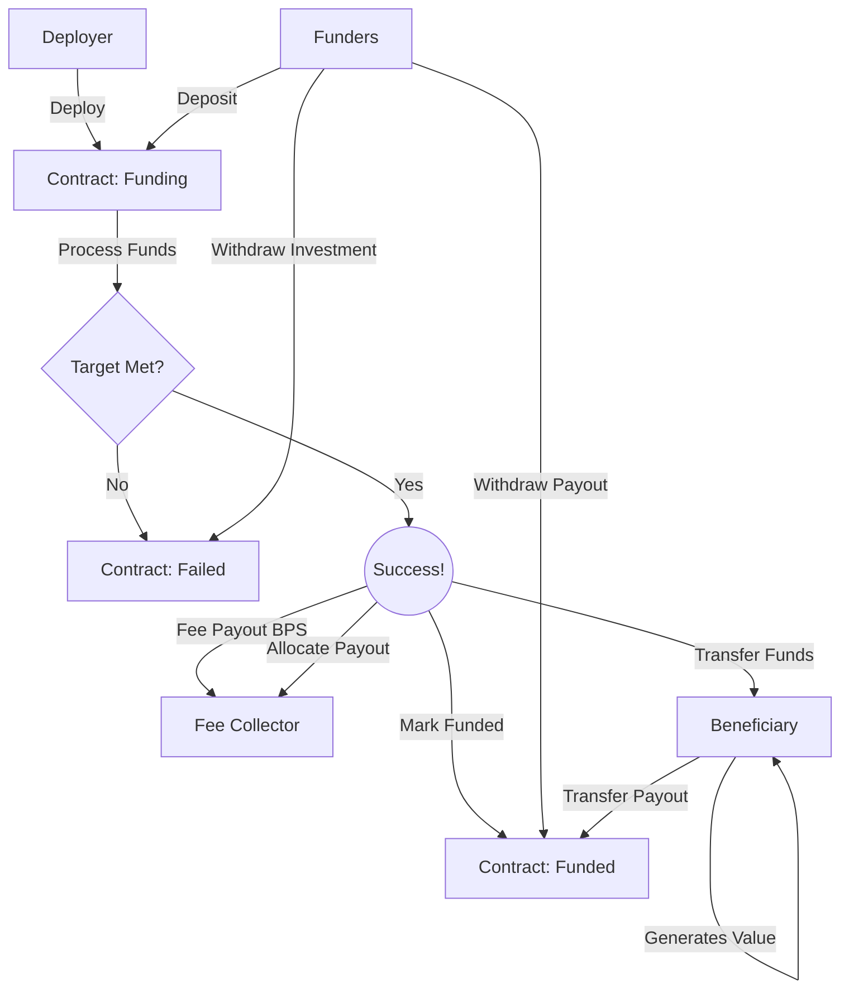

# ERC20CrowdFinancingV1

The ERC20CrowdFinancingV1 contract enables groups of people to collectively finance a project with the option of receiving returns on their investment.

### Overview

A minimal contract for accumulating funds from many accounts, transferring the balance
to a beneficiary, and allocating payouts to depositors as the beneficiary returns funds.

The primary purpose of this contract is financing a trusted beneficiary with the expectation of ROI.
If the fund target is met within the fund raising window, then processing the funds will transfer all
raised funds to the beneficiary, minus optional fee, and change the state of the contract to allow for payouts to occur.

If the fund target is not met in the fund raise window, the raise fails, and all depositors can
withdraw their initial investment.

#### Deposits

Accounts deposit tokens by first creating an allowance in the token contract, and then
calling the deposit function, which will transfer the entire allowance if all contraints
are satisfied.

#### Payouts

The beneficiary makes payments by transfering tokens to the contract, or invoking the makePayment
function which works similar to the deposit function.

As the payout balance accrues, depositors can invoke the withdraw function to transfer their
payout balance.

#### Fees

The contract can be initialized with an optional fee collector address with options for two
kinds of fees, in basis points. A value of 250 would mean 2.5%.

Type A Fee: Upon processing, a percentage of the total deposit amount is carved out and sent
to the fee collector. The remaining balance is sent to the beneficiary.
Type B Fee: Upon processing, the fee collector is added to the cap table as a depositor with a
value commensurate with the fee, and the total deposits is also increased by that amount.

### A Visual

### Deployment

The CrowdFunding contract is deployed as a logic contract, and proxies are deployed for each individual campaign.

We use beacons to support upgrading the logic for all campaigns, if that is required.

Process:
* Deploy the logic contract
  * `forge create ERC20CrowdFinancingV1 --private-key KEY`
  * Capture address, eg: 0x8f86403A4DE0BB5791fa46B8e795C547942fE4Cf
* Deploy the FabricBeacon contract with reference to the financing contract
  * `forge create FabricBeacon --private-key KEY --constructor-args 0x8f86403A4DE0BB5791fa46B8e795C547942fE4Cf`
  * Capture address, eg: 0x9d4454B023096f34B160D6B654540c56A1F81688
* Deploy the instance contract referencing the beacon and passing in the initializer data
  * `forge create FabricProxy --private-key 0xac0974bec39a17e36ba4a6b4d238ff944bacb478cbed5efcae784d7bf4f2ff80 --constructor-args 0x9d4454B023096f34B160D6B654540c56A1F81688 0x848ff684000000000000000000000000f39fd6e51aad88f6f4ce6ab8827279cfffb92266000000000000000000000000000000000000000000000000000000000000c35000000000000000000000000000000000000000000000000000000000004c4b40000000000000000000000000000000000000000000000000000000000000271000000000000000000000000000000000000000000000000000000000000186a00000000000000000000000000000000000000000000000000000000063582af0000000000000000000000000000000000000000000000000000000006358390000000000000000000000000070e0ba845a1a0f2da3359c97e0285013525ffc49`
  * Generating the calldata: `cast calldata "initialize(address,uint256,uint256,uint256,uint256,uint256,uint256,address)" BENEFICIARY_ADDR MIN_TARGET MAX_TARGET MIN_DEPOSIT MAX_DEPOSIT START_TIMESTAMP_S END_TIMESTAMP_S TOKEN_ADDR`
  * Exammple: `cast calldata "initialize(address,uint256,uint256,uint256,uint256,uint256,uint256,address)" 0xf39fd6e51aad88f6f4ce6ab8827279cfffb92266 50000 5000000 10000 100000 1666722824 1666726424 0x82e01223d51Eb87e16A03E24687EDF0F294da6f1`
  * The address emitted is the campaign address

Only the last step is required for deploying subsequent campaigns.
