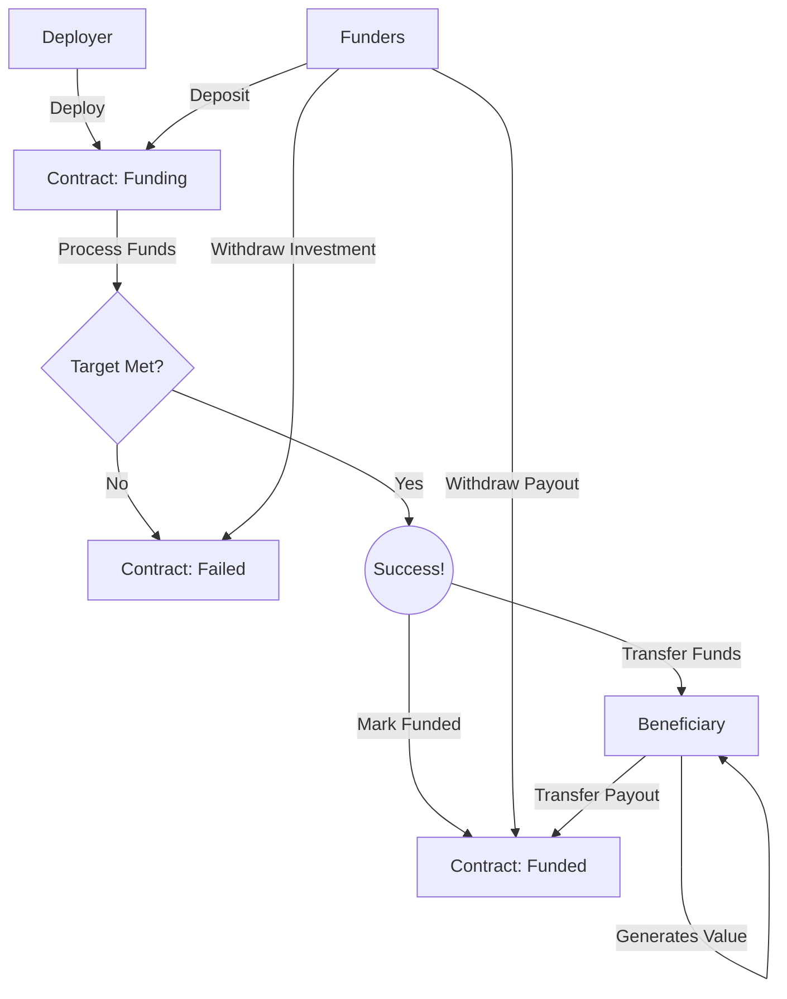

# Crowd Financing Contracts

Crowd financing contracts enable groups of people to collectively finance a project and receive returns on their investment.

## Version 1 - ETH Only

Version 1 only accepts deposits of eth, and allows withdraws of eth.

### Deployment

When deploying a financing contract, there are several important variables:

1. Minimum Funding Target - The minimum amount of wei required for the round to be successful
2. Maximum Funding Target - The maximum amount of wei allowed
3. Minimum Deposit - The minimum amount of wei an account can contribute to particiapte
4. Maximum Deposit - The maximum amount of wei an account can contribute
5. Beneficiary - The target account to transfer funds, if the round is succesful
6. Deadline - A date in the future when the round can be considered for success of failure

### Primary States

There are primary three states of the contract

1. Funding - Deposits are made until Maximum Funding Target is met, or the Deadline is reached
2. Funded - The Minimum Funding Target was met by the Deadline, funds were transferred to the Beneficiary, and payout withdraws are allowed
3. Failed - The Minimum Funding Target was not met by the Deadline. Funders can withdraw their initial investment.

### A Visual

