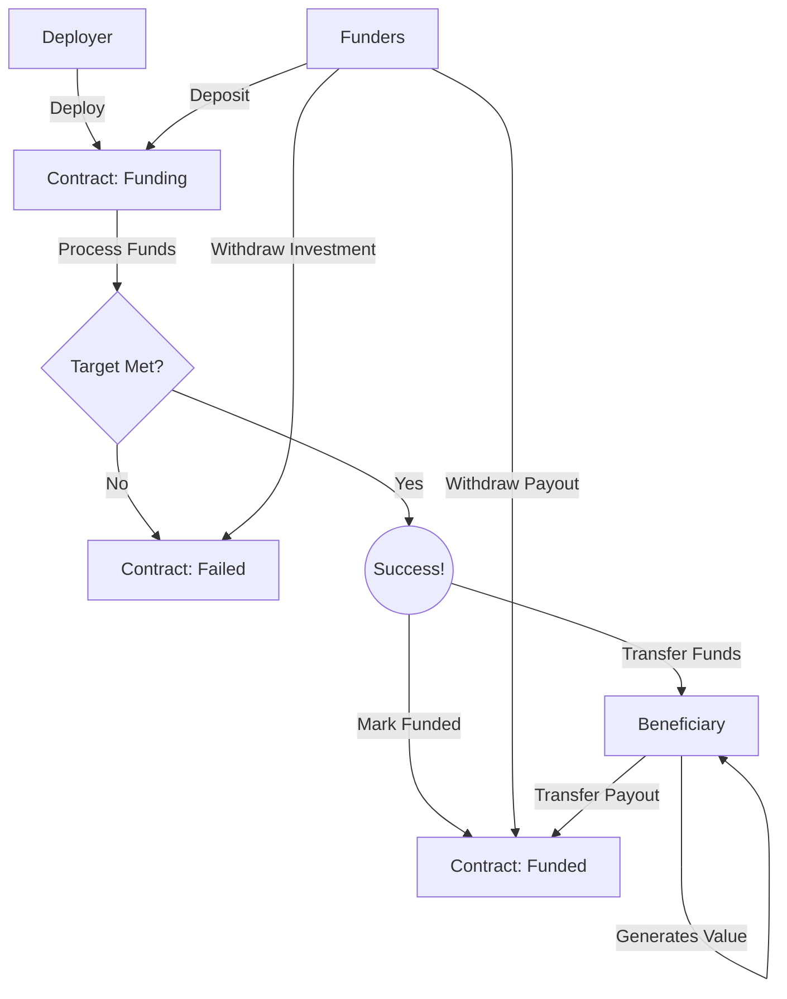

# Crowd Financing Contracts

Crowd financing contracts enable groups of people to collectively finance a project and receive returns on their investment.

## Version 1 - ETH Only

Version 1 only accepts deposits of eth, and allows withdraws of eth.

### Deployment

When deploying a financing contract, there are several important variables:

1. Minimum Funding Target - The minimum amount of wei required for the round to be successful
2. Maximum Funding Target - The maximum amount of wei allowed
3. Minimum Deposit - The minimum amount of wei an account can contribute to particiapte
4. Maximum Deposit - The maximum amount of wei an account can contribute
5. Beneficiary - The target account to transfer funds, if the round is succesful
6. Deadline - A date in the future when the round can be considered for success of failure

### Primary States

There are primary three states of the contract

1. Funding - Deposits are made until Maximum Funding Target is met, or the Deadline is reached
2. Funded - The Minimum Funding Target was met by the Deadline, funds were transferred to the Beneficiary, and payout withdraws are allowed
3. Failed - The Minimum Funding Target was not met by the Deadline. Funders can withdraw their initial investment.

### A Visual

### Deployment

The CrowdFunding contract is deployed as a logic contract, and proxies are deployed for each individual campaign.

We use beacons to support upgrading the logic for all campaigns, if that is required.

Process:
* Deploy the logic contract
  * `forge create ERC20CrowdFinancingV1 --private-key KEY`
  * Capture address, eg: 0x8f86403A4DE0BB5791fa46B8e795C547942fE4Cf
* Deploy the FabricBeacon contract with reference to the financing contract
  * `forge create FabricBeacon --private-key KEY --constructor-args 0x8f86403A4DE0BB5791fa46B8e795C547942fE4Cf`
  * Capture address, eg: 0x9d4454B023096f34B160D6B654540c56A1F81688
* Deploy the instance contract referencing the beacon and passing in the initializer data
  * `forge create FabricProxy --private-key 0xac0974bec39a17e36ba4a6b4d238ff944bacb478cbed5efcae784d7bf4f2ff80 --constructor-args 0x9d4454B023096f34B160D6B654540c56A1F81688 0x848ff684000000000000000000000000f39fd6e51aad88f6f4ce6ab8827279cfffb92266000000000000000000000000000000000000000000000000000000000000c35000000000000000000000000000000000000000000000000000000000004c4b40000000000000000000000000000000000000000000000000000000000000271000000000000000000000000000000000000000000000000000000000000186a00000000000000000000000000000000000000000000000000000000063582af0000000000000000000000000000000000000000000000000000000006358390000000000000000000000000070e0ba845a1a0f2da3359c97e0285013525ffc49`
  * Generating the calldata: `cast calldata "initialize(address,uint256,uint256,uint256,uint256,uint256,uint256,address)" BENEFICIARY_ADDR MIN_TARGET MAX_TARGET MIN_DEPOSIT MAX_DEPOSIT START_TIMESTAMP_S END_TIMESTAMP_S TOKEN_ADDR`
  * Exammple: `cast calldata "initialize(address,uint256,uint256,uint256,uint256,uint256,uint256,address)" 0xf39fd6e51aad88f6f4ce6ab8827279cfffb92266 50000 5000000 10000 100000 1666722824 1666726424 0x82e01223d51Eb87e16A03E24687EDF0F294da6f1`
  * The address emitted is the campaign address

Only the last step is required for deploying subsequent campaigns.

