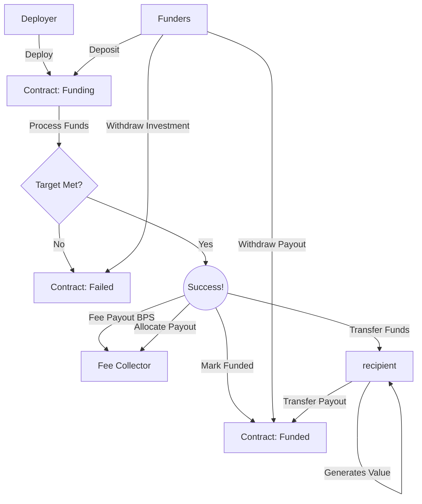

# CrowdFinancingV1

The CrowdFinancingV1 contract enables groups of people to collectively finance a project with the option of receiving returns on their investment.

### Overview

A minimal contract for accumulating funds from many accounts, transferring the balance
to a recipient, and allocating payouts to depositors as the recipient returns funds.

The primary purpose of this contract is financing a trusted recipient with the expectation of ROI.
If the fund target is met within the fund raising window, then processing the funds will transfer all
raised funds to the recipient, minus optional fee, and change the state of the contract to allow for payouts to occur.

If the fund target is not met in the fund raise window, the raise fails, and all depositors can
withdraw their initial investment.

#### Deposits

Accounts deposit tokens by first creating an allowance in the token contract, and then
calling the contributeERC20 function, which will transfer the entire allowance if all contraints
are satisfied.

For ETH campaigns, accounts call the contributeEth function with the transaction value message
set to the amount of eth to transfer.

#### Payouts

The recipient makes payments by transfering tokens to the contract, or invoking the yieldERC20
or yieldEth function which works similar to the deposit functions.

As the payout balance accrues, depositors can invoke the withdraw function to transfer their
payout balance.

#### Fees

The contract can be initialized with an optional fee collector address with options for two
kinds of fees, in basis points. A value of 250 would mean 2.5%.

Type A Fee: Upon processing, a percentage of the total deposit amount is carved out and sent
to the fee collector. The remaining balance is sent to the recipient.
Type B Fee: Upon processing, the fee collector is added to the cap table as a depositor with a
value commensurate with the fee, and the total deposits is also increased by that amount.


### A Visual



### Deployment

The CrowdFunding contract is deployed as a logic contract, and proxies are deployed for each individual campaign.

For each network, a corresponding CrowdFinancingV1Factory will exist to help deploy a Clone of the logic contract,
and initialize it with specified parameters.

```solidity
CrowdFinancingV1 campaign = CrowdFinancingV1Factory(address).deploy(
  address recipient,
  uint256 minGoal,
  uint256 maxGoal,
  uint256 minContribution,
  uint256 maxContribution,
  uint32 duration,
  address erc20TokenAddr
);
```

It may make sense to allow for upgradeable contracts in the future, but currently we feel
the risks outweigh the benefits.


### DataQuiltRegistry

The DataQuilt registry is an ERC721 contract which allows depositors to mint a unique NFT for their
contribution. A depositor can only mint one NFT per campaign.

As of now, the minter would send a unique ID to mint, where the ID itself is comprised of the following:
1. The address of the campaign
2. 64 reserved bits
3. 32 bits representing the unique tile configuration

```solidity
uint256(bytes32(abi.encodePacked(campaignAddress, uint64(0), tileConfiguration)))
```

The tile configuration is generated in the fabric UI, but any random integer will work, as
long as it's unique.
